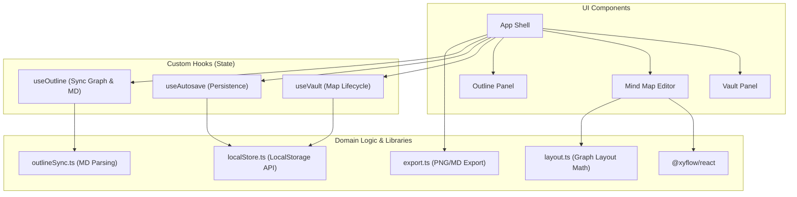

# My Mind Maps

Browser-based React app for building mind maps with local autosave and markdown outline support.

## Features

- Interactive node + edge editing with `@xyflow/react`
- Keyboard-first topic editing (no popup prompts)
- Add child/sibling topics and rename/delete topics via shortcuts
- Branch-style mind map rendering by default
- Organize command for clean map layout
- Markdown outline panel with one-click copy
- PNG export of the current mind map view
- Auto-saved browser-local storage for multiple mind maps

## Architecture



## Keyboard Shortcuts

- `Enter`: add child topic and focus text edit immediately
- `Tab`: add sibling topic and focus text edit immediately
- `F2` or `Ctrl/Cmd+E`: rename selected topic inline
- `Delete` / `Backspace`: delete selected node (root is protected)
- `ArrowUp` / `ArrowDown`: move selection across topics
- `Ctrl/Cmd+S`: export PNG
- `Ctrl/Cmd+N`: create a new map
- `Ctrl/Cmd+L`: organize map layout

## Quick Start

1. Install dependencies:

```bash
npm install
```

2. Run the app:

```bash
npm run dev
```

## Testing

```bash
npm test
```

## License

MIT. See `LICENSE`.
