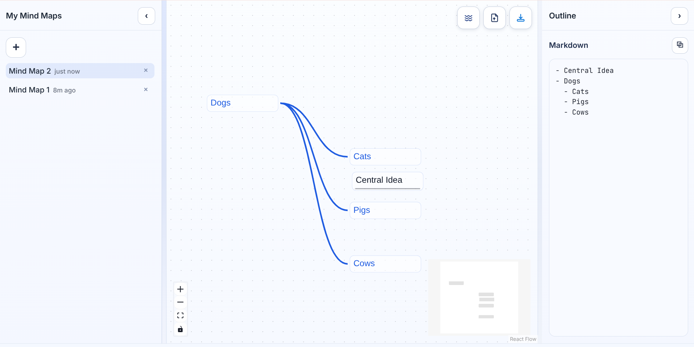
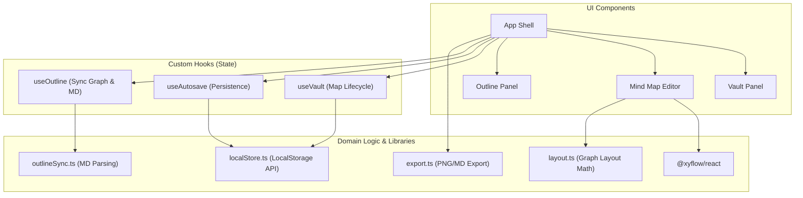

# My Mind Maps

Browser-based React app for building mind maps with local autosave and markdown outline support.



## Features

- **Vault-based Management**: Dedicated panel to create, switch, and manage multiple mind maps.
- **Interactive Graph Editing**: Fluid node and edge interaction powered by `@xyflow/react`.
- **Keyboard-Centric Workflow**: Optimized for speed with shortcuts for adding children (`Enter`), siblings (`Tab`), and inline renaming (`F2`).
- **Markdown Synchronization**: Real-time Markdown outline panel with one-click copy for seamless documentation workflows.
- **Local-First Persistence**: Automatic background saving to browser LocalStorage—your data stays on your device.
- **Modern UI/UX**: Professional three-column layout (Vault, Editor, Outline) with branch-style rendering.
- **One-Click Export**: High-quality PNG export for sharing and presentations.
- **Automated Layout**: Built-in "Organize" command to instantly clean up and balance your map.

## Architecture


```mermaid
graph TD
    subgraph UI["UI Components"]
        App["App Shell"]
        VaultPanel["Vault Panel"]
        Editor["Mind Map Editor"]
        OutlinePanel["Outline Panel"]
        
        App --> VaultPanel
        App --> Editor
        App --> OutlinePanel
    end

    subgraph Hooks["Custom Hooks (State)"]
        useVault["useVault (Map Lifecycle)"]
        useAutosave["useAutosave (Persistence)"]
        useOutline["useOutline (Sync Graph & MD)"]
        
        App --> useVault
        App --> useAutosave
        App --> useOutline
    end

    subgraph Libs["Domain Logic & Libraries"]
        ReactFlow["@xyflow/react"]
        LocalStore["localStore.ts (LocalStorage API)"]
        Layout["layout.ts (Graph Layout Math)"]
        Export["export.ts (PNG/MD Export)"]
        OutlineSync["outlineSync.ts (MD Parsing)"]

        Editor --> ReactFlow
        useVault --> LocalStore
        useAutosave --> LocalStore
        Editor --> Layout
        App --> Export
        useOutline --> OutlineSync
    end
```

## Technical Improvements

- **Modern Tooling**: Upgraded to **Vite 8** and **Vitest 4** for faster builds and improved security.
- **Robust Testing**: Comprehensive unit test suite covering graph operations, layout math, and Markdown sync.
- **Clean Architecture**: Domain logic is decoupled from React components into dedicated utility libraries.
- **Strict Typing**: Full TypeScript implementation for enhanced safety and developer experience.

## Keyboard Shortcuts

- `Enter`: add child topic and focus text edit immediately
- `Tab`: add sibling topic and focus text edit immediately
- `F2` or `Ctrl/Cmd+E`: rename selected topic inline
- `Delete` / `Backspace`: delete selected node (root is protected)
- `ArrowUp` / `ArrowDown`: move selection across topics
- `Ctrl/Cmd+S`: export PNG
- `Ctrl/Cmd+N`: create a new map
- `Ctrl/Cmd+L`: organize map layout

## Quick Start

1. Install dependencies:

```bash
npm install
```

2. Run the app:

```bash
npm run dev
```

## Testing

```bash
npm test
```

## Key Packages

- **React 18**: Core UI framework and state management.
- **@xyflow/react**: Interactive node-based graph editor for mind mapping.
- **html-to-image**: Converts DOM nodes to high-quality PNG images for export.
- **Vite 8**: Modern frontend build tool and fast development server.
- **Vitest 4**: Vite-native unit testing framework for project logic.
- **TypeScript**: Static typing for improved developer experience and safety.


## License

MIT. See `LICENSE`.
